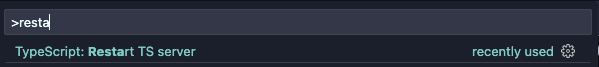

# Weather App


A cross-platform app starter based on [create-t3-turbo](https://github.com/t3-oss/create-t3-turbo) and [all things Fernando Rojo](https://github.com/nandorojo) ([Solito](https://solito.dev/), [Dripsy](https://www.dripsy.xyz/), [Moti](https://moti.fyi/), etc.).

## 🚀 Getting Started

Install [Node.js](https://nodejs.org/en/download/)

Install [pnpm](https://pnpm.io/installation#using-npm) using npm, unless you prefer something else

Install [VSCode](https://code.visualstudio.com/download)

Clone this project to your computer and open it in VSCode

Accept any recommendations given to you by VSCode after opening the project

Open a terminal in VSCode where your project is open

Install dependencies:

```bash
pnpm i
```

> Keep going while the dependencies install

[Provision a PostgreSQL database with Railway](https://railway.app/new) and get the database URL

In the project root, create a `.env` file with the following, and replace all `...`'s with your corresponding API keys:

```env
DATABASE_URL=...
```

Ensure you setup Expo to play nicely for your setup, by following [create-t3-turbo](https://github.com/t3-oss/create-t3-turbo)'s [Expo setup guide](https://github.com/t3-oss/create-t3-turbo#configure-expo-dev-script).

In your VSCode terminal, start development:

```bash
pnpm dev
```

## Quirks

This is a monorepo using [TurboRepo](https://turbo.build/repo) and [pnpm](https://pnpm.io/).

As such, installing packages is a little different than you might be used to. Skim through the documentation of both to get a feel for how they work, if the tips below are insufficient.

### Installing packages

Here are some examples of how you typically would install packages using `pnpm` from the root:

```bash
pnpm i <package> --filter=expo
```

```bash
pnpm i -D <package> --filter=expo
```

```bash
pnpm i -D <package> --filter=expo --filter=web
```

> My experience is that `pnpm i` with filtering works the same from anywhere in the project, but other commands, for example `package.json`-scripts like `pnpm dev`, may vary. This may be wrong, so feel free to correct me.

To install packages using [Expo](https://docs.expo.io/) however (if you want their automatic versioning, for example), you need to specify location, for example by `cd`-ing in to the relevant directory.

For example, to install `expo-location` in the `expo` package:

```bash
cd packages/expo
pnpx expo install expo-location
```

> When installing packages using Expo, the docs most often use `npx`, but as we're using `pnpm`, I recommend using `pnpx`, so:
>
> ❌ ~~`npx expo install expo-location`~~  
> ✅ `pnpx expo install expo-location`

### Pure JS dependencies

If you're installing a JavaScript-only dependency that will be used across platforms, install it in `packages/app`:

```sh
pnpm i date-fns --filter=app
```

### Native dependencies

If you're installing a library with any native code, you must install it in `apps/expo`:

```sh
pnpm i react-native-reanimated --filter=expo
```

Or using Expo:

```sh
cd packages/expo
pnpx expo install react-native-reanimated
cd ../..
```

You can also install the native library inside of `packages/app` if you want to get autoimport for that package inside of the `app` folder. However, you need to be careful and install the _exact_ same version in both packages. If the versions mismatch at all, you'll potentially get terrible bugs. This is a classic monorepo issue. I use `lerna-update-wizard` to help with this (you don't need to use Lerna to use that lib).

## 🔐 Authentication (☢️ WIP)

[Clerk](https://clerk.dev) handles authentication.

To enable, [create a Clerk account](https://dashboard.clerk.dev/sign-up), [add a Clerk application](https://dashboard.clerk.dev/apps/new) and set the Clerk API keys in the `.env` file:

```env
CLERK_BACKEND_API=...
NEXT_PUBLIC_CLERK_FRONTEND_API=...
```

## 🤯 Facing problems?

Below are ways to solve them.

> _If you ask for help before attempting these fixes, and they would have solved your problem, you owe the person who helped you a beer (or equivalent)._
>
> _However, if it's a new problem or the instructions we're unclear, you'll get honor and recognition points. Maybe even a beer (or equivalent)._

### Generally

Restart VSCode.

Restart your computer.

### Permission errors when running commands (Mac/Linux)

Prefix the command with `sudo`, e.g.:

```bash
sudo pnpm i
```

### Pulling changes from the repository

Always check for and install new dependecies when you pull changes from the repository:

```bash
pnpm i
```

### Wrong version of Node

- Check your version with
  ```bash
  node -v
  ```
- Install the correct version according to `engines` in `package.json`

### Wrong version of pnpm

Check your version with

```bash
pnpm -v
```

Install the correct version according to `engines` in `package.json`

### Using 32-bit version of Node

Getting `error Command failed with exit code 3221225477`?

Check if you're using 32-bit Node.js:

```bash
node -p "process.arch"
```

If so, install the 64-bit version instead.

Or buy a Mac.

### Divergent git branches

```bash
git config pull.rebase false
```

### Ports already in use (Mac)

Kill the processes using the ports:

```bash
kill -9 $(lsof -t -i:3000) && kill -9 $(lsof -t -i:19000)
```

### Weird typescript errors

Open up any TypeScript file in the project and press...

- <kbd>⌘</kbd> + <kbd>Shift</kbd> + <kbd>P</kbd> on Mac
- <kbd>Ctrl</kbd> + <kbd>Shift</kbd> + <kbd>P</kbd> on Windows

Then restart the TypeScript server, with the command `TypeScript: Restart TS Server`:


