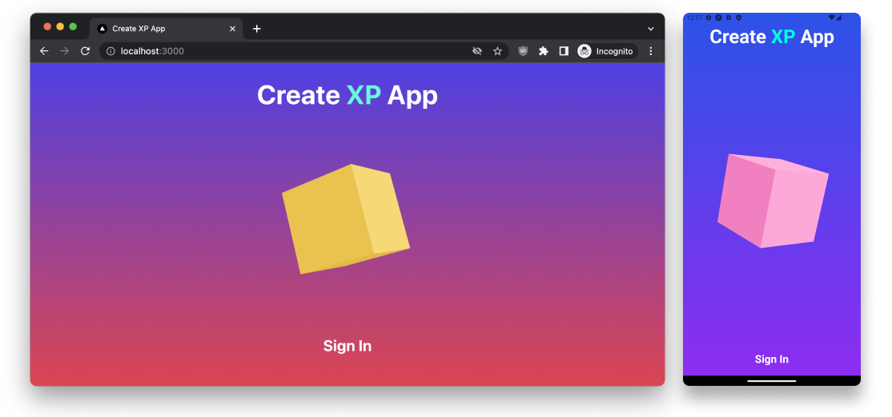
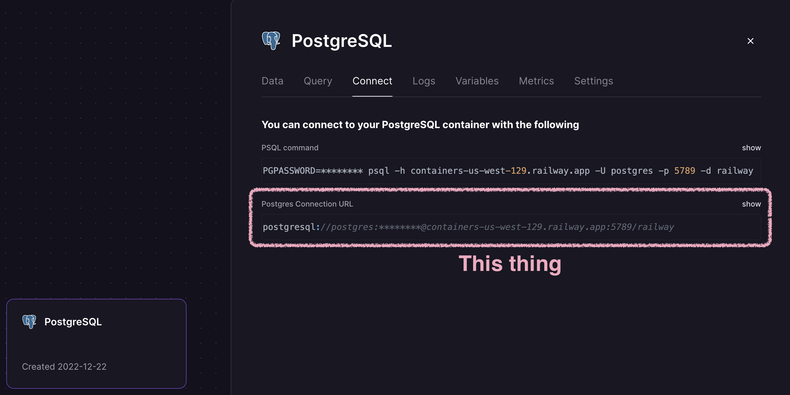

# Create XP App

Plug-n-play app template to write code only once, and have it run on iOS, Android and Web.

Key features:

- [Expo](https://expo.dev/) for native iOS and Android
- [Next.js](https://nextjs.org/) for web
- [Solito](https://solito.dev/) for code sharing
- [Dripsy](https://www.dripsy.xyz/) + [Moti](https://moti.fyi/) for styling and animations
- [NativeWind](https://www.nativewind.dev/) for alternative styling
- [Three.js](https://threejs.org/) for 3D graphics
- [Skia](https://shopify.github.io/react-native-skia/) for 2D graphics
- [Clerk](https://clerk.dev/) for authentication
- [Prisma](https://www.prisma.io/) + [tRPC](https://trpc.io/) for backend

_Based on [create-t3-turbo](https://github.com/t3-oss/create-t3-turbo) and [all things Fernando Rojo](https://github.com/nandorojo) ([Solito](https://solito.dev/), [Dripsy](https://www.dripsy.xyz/), [Moti](https://moti.fyi/), etc.). Authentication is inspired by [create-t3-turbolito](https://github.com/ebg1223/create-t3-turbolito). Huge thanks <3._

## 🧠 Philosophy

I created this to have a solid foundation for my own projects, that will allow me to get inspired and create applications quickly.

The philosophy behind it is that having fun and powerful tools at hand will allow you to play around and create cool stuff. You can clean up and do optimizations later on.

Sometimes you just need an inspiring prototype, and this project will help you get there.

## 🚀 Getting Started

Install [Node.js](https://nodejs.org/en/download/)

Install [pnpm](https://pnpm.io/installation#using-npm) using npm, unless you prefer something else

Install [VSCode](https://code.visualstudio.com/download)

Clone this project to your computer and open it in VSCode

Accept any recommendations given to you by VSCode after opening the project

Open a terminal in VSCode where your project is open

Install dependencies:

```bash
pnpm i
```

Keep going while the dependencies install

[Provision a PostgreSQL database with Railway](https://railway.app/new) and get the Postgres Connection URL



In the project root, create a `.env` file with the following, and replace all `...`'s with your corresponding API keys:

```env
DATABASE_URL=...
```

Setup your database:

```bash
pnpm db:setup
```

To get authentication working, [create a Clerk account](https://dashboard.clerk.dev/sign-up), [add a Clerk application](https://dashboard.clerk.dev/apps/new) and set the Clerk API keys in the `.env` file:

```env
NEXT_PUBLIC_CLERK_PUBLISHABLE_KEY=pk_***
CLERK_SECRET_KEY=sk_***
```

Ensure you setup Expo to play nicely for your setup, by following [create-t3-turbo](https://github.com/t3-oss/create-t3-turbo)'s [Expo setup guide](https://github.com/t3-oss/create-t3-turbo#configure-expo-dev-script).

In your VSCode terminal, start development:

```bash
pnpm dev
```

## 👨‍🎨 Styling

You can style a component using either [NativeWind](https://www.nativewind.dev/) or [Dripsy](https://www.dripsy.xyz/) + [Moti](https://moti.fyi/).

NativeWind is quick and nimble, while Dripsy + Moti will give you more fine-grained control and animations.

Feel free to combine them as you see fit, but keep in mind that they are not properly setup to work seamlessly together.

## 3️⃣🍆 3D with Three.js

[React Three Fiber](<[http](https://github.com/pmndrs/react-three-fiber)>) is used to render 3D graphics ([docs](https://docs.pmnd.rs/react-three-fiber/getting-started/introduction)).

Use `📁 threejs/Canvas.tsx` to automatically use the correct implementation for the platform you're on (with consistent styling as bonus 😉), so that you get native rendering on iOS and Android, and web rendering on the web, but still code share everything.

> **Note**  
> You _can_ use the regular Canvas component from `react-three-fiber` if you _really_ want to (nice to have as a fallback), but you'll not get butter smooth animations and interactions on iOS and Android.

> **Warning**  
> The iOS simulator does not render 3D at all (as of 2022.12.19), but real apple devices work just fine (see
> https://github.com/pmndrs/react-three-fiber/issues/2546).

## 🎨 Skia (☢️ WIP)

[Skia](https://shopify.github.io/react-native-skia/) is a 2D graphics library that can be used to render really cool 2D graphics.

Implemented for iOS and Android, but code sharing with Next.js is WIP atm.

## Quirks

This is a monorepo using [Turborepo](https://turbo.build/repo) and [pnpm](https://pnpm.io/).

As such, installing packages is a little different than you might be used to. Skim through the documentation of both to get a feel for how they work, if the tips below are insufficient.

### Installing packages

Here are some examples of how you typically would install packages using `pnpm` from the root:

```bash
pnpm i <package> --filter=expo
```

```bash
pnpm i -D <package> --filter=expo
```

```bash
pnpm i -D <package> --filter=expo --filter=web
```

> **Note**  
> My experience is that `pnpm i` with filtering works the same from anywhere in the project, but other commands, for example `package.json`-scripts like `pnpm dev`, may vary. This may be wrong, so feel free to correct me.

To install packages using [Expo](https://docs.expo.io/) (maybe you want their [automatic versioning](https://docs.expo.dev/workflow/expo-cli/#install)), you need to specify location, by `cd`-ing in to the relevant directory.

To install a package (here `expo-location`) in the `expo` package:

```bash
cd packages/expo
pnpx expo install expo-location
```

> **Note**  
> When installing packages using Expo, the docs most often suggest `npx`, but as we're using `pnpm`, I recommend using `pnpx`, so:
>
> ❌ ~~`npx expo install expo-location`~~  
> ✅ `pnpx expo install expo-location`

### Pure JS dependencies

If you're installing a JavaScript-only dependency that will be used across platforms, install it in `packages/app`:

```sh
pnpm i date-fns --filter=app
```

### Native dependencies

If you're installing a library with any native code, you must install it in `📁 apps/expo`, but for good DX in `📁 packages/app`, you should install it in both places:

```sh
pnpm i:native react-native-reanimated
```

> Which under the hood is the same as:
>
> ```sh
> pnpm i --filter=expo --filter=app react-native-reanimated
> ```

### Syncing native dependencies

To sync the versions of all packages installed in both `📁 packages/app` and `📁 packages/expo`, you can use syncpack to find mismatching versions:

```sh
pnpm syncpack:mismatches
```

You should fix these manually or create a script that fits your workflow.

If some packages are only installed in `📁 app/expo`, you'll need to add those to `📁 packages/app/package.json` manually.

If you get errors on the web after installing a native dependency, you may need to tell Next.js to transpile the module (or it's dependencies - check the error logs) in `📁 apps/next/next.config.js`:

```js
const withTM = require("next-transpile-modules")([
  // Add the module here, e.g.:
  "recyclerlistview",
]);
```

## 🤯 Facing problems?

Below are ways to solve them.

### Generally

1. Restart VSCode.
2. Clean the project and reinstall dependencies:  
   `pnpm clean:workspaces`  
   `pnpm i`
3. Restart your computer.

### Scripts not running properly?

Some terminals don't support chaining commands with `&&`, `||`, `;`, and so on, so you may need to run them separately. Checkout the `package.json`-scripts to see how they are setup and run them in the same order.

### Permission errors when running commands (Mac/Linux)

Prefix the command with `sudo`, e.g.:

```bash
sudo pnpm i
```

### Pulling changes from the repository

Always check for and install new dependecies when you pull changes from the repository:

```bash
pnpm i
```

### Wrong version of Node

- Check your version with
  ```bash
  node -v
  ```
- Install the correct version according to `engines` in `package.json`

### Wrong version of pnpm

Check your version with

```bash
pnpm -v
```

Install the correct version according to `engines` in `package.json`

### Using 32-bit version of Node

Getting `error Command failed with exit code 3221225477`?

Check if you're using 32-bit Node.js:

```bash
node -p "process.arch"
```

If so, install the 64-bit version instead.

Or buy a Mac.

### Weird typescript errors

Open up any TypeScript file in the project and press...

- <kbd>⌘</kbd> + <kbd>Shift</kbd> + <kbd>P</kbd> on Mac
- <kbd>Ctrl</kbd> + <kbd>Shift</kbd> + <kbd>P</kbd> on Windows

Then restart the TypeScript server, with the command `TypeScript: Restart TS Server`.

### Divergent git branches

```bash
git config pull.rebase false
```

### Ports already in use

Kill the processes using the ports:

```bash
pnpm killports
```
